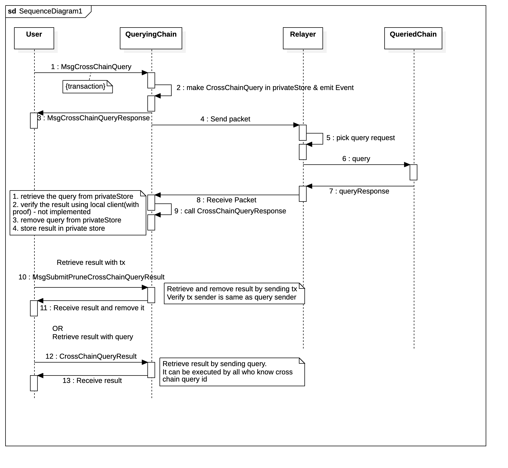

# Architecture

***1~3***\
*related tx: MsgSubmitCrossChainQuery*

User sends tx which requests cross chain query.

When ibc_query module receives cross chain query request, check whether timeout is valid first.

***4~8***\
*operations in [relayer](https://github.com/validance/ibc-rs)*

***9***\
*related tx: MsgSubmitCrossChainQueryResult*

***10 ~ 11 or 12 ~ 13***\
*related tx: MsgSubmitPruneCrossChainQueryResult*
*related query: QueryCrossChainQueryResult*